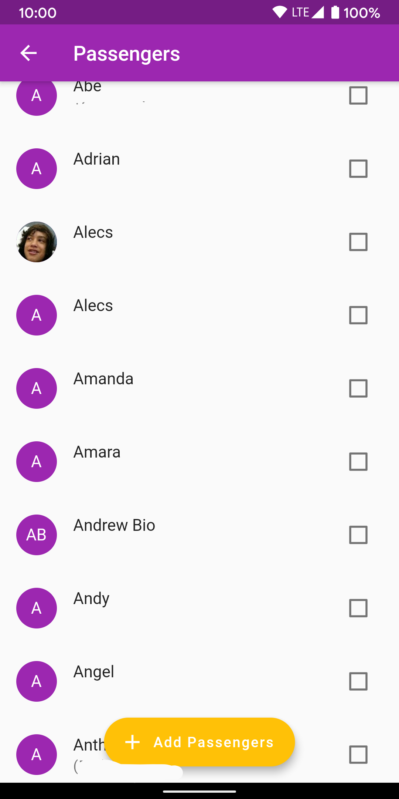

# 710 by byteMe

710 is a casual application that will calculate the total cost of a carpool ride. Depending on the number of passengers, the cost will be divided. The user can decided who to bill and the type of transaction. This application will keep records of the carpool receipt.

## Features
- Use GoogleMaps to go from Point A to B, save it as a Trip
- Add Contacts straight from your device
- Calculate the cost of a Trip
- Save Trips in the cloud
- Track how much a Contact owes you, save it as a PDF and share it with them!
- Send or receieve payments from your Contacts
- Sign in with Google Authentication

## Requirements
- Android Phone
- Internet Access
- Mobile Data
- A Google Account

# Installation
1. Clone our [repository](https://github.com/taylor-meyer/710) using the terminal, enter `git clone https://github.com/taylor-meyer.git` if you have Git installed. Else, press that green button to download the repository.
2. Open in either Android Studio or Visual Studio Code
3. Connect an Android device or start an Android Virtual Emulator (Android Studio)
4. Head on over to [Google Cloud](https://cloud.google.com/) and get these 4 api keys:
    - Google Maps Android SDK
    - Google Maps iOS SDK (_if you want iOS port to work_)
    - Google Places Key
    - Google Maps Geo Key
5. Replace all `API_Key` placeholders
6. Type `flutter run` in the terminal. _If you are using a physical Android device, keep it plugged in_ 

# How To Use The App
1. [Signing in](#Signing-In)
2. [Navigating through the menu](#Navigating-through-the-menu)
3. [Search for locations](#Search-for-locations) 
4. [Adding contacts](#Adding-contacts)
5. [View your bills](#View-your-bills) 
6. [Create PDF receipt](#Create-PDF-receipt)
7. [Send or request money](#Send-or-request-money)
8. [Toggle dark theme](#Toggle-dark-theme)

# Signing In
Your first time starting the app, you should be met with a sign-in with Google button. Simply press the button and select an account you would like to use. We do not gather any information from your Google account, we only require your email, name, and profile picture.

If you happen to get logged out of the app, there is a sign-in button in the Settings Page

# Navigating through the menu
At the top left of your screen, you should be able to see three horizontal lines, *it looks like a hamburger*. If you press it, all menu options will slide in from the left side of your screen. From here, you can get to any other page that is listed, report a bug, or sign out.

Here's a general explanation of each page:
- Start trip: Anything navigation related
- Billing: View all previous bills for people that owe you money or vice versa
- Settings: Change your profile information, your preferred payment service, or log back into your Google account
- Info: See all statistics that we have collected from you
- About: A brief message about our app and what we're about :thinking:
- Open contacts: A list of all contacts that are stored on your list, edit them if you want
- Link to payment service: In-app browser that allows you to make financial decisions with our app
- Report an issue: If there's an issue, you will be able to send an email to us with your preferred choice of email
- Logout: Logout of the application

At any point if change your mind, simply tap outside of the menu to close it.

# Search for locations
If you're ready to head out into the world, make sure you give us your location permission, then simply open the [hamburger menu](#Navigating-through-the-menu) and press `Start Trip`. Once open you have multiple options on how you decide to start your trip:

1. Search for your location
2. [Add Passengers](#Adding-contacts)
3. Ping your location

Once you are done, go ahead and open the slide up panel and press `Confirm Passengers`. If you, swip on any passenger to dismiss them from your trip.

Then once all is reviewed, you can press `Open GoogleMaps` to be taken to GoogleMaps either from the app or a web browser if you do not have it installed.

# Adding contacts
First, this is under the assumption that your phone is filled with contacts on the system level Phone/Contacts app. If you don't have any, add some before we get started. Once you have your contacts, [head to the Start trip page](#Navigating-through-the-menu), then press the button at the bottom right. To see your contacts, you have to grant us the permission to look at the list of your contacts, this includes names, numbers, emails and more (we only care about those three though). From here select any of the contacts you would like to use for your trip and then confirm that it's all correct.

# View your bills
Open up the hamburger menu and go to `Billing`. First, you should have already have a bill, if not [start your very first trip](#Search-for-locations). From here select any trip that is listed, you'll then be able to see any passenger that came along with you. Tap again once more if you want to see a detailed view on the passenger and scroll down for any other trips you two have shared.

# Create PDF receipt
Follow the same [instructions](#View-your-bills) to get to the detailed view on your passenger. You should be able to see you passenger, their name and how much they owe you or vice versa. At the top right of the page, there is a PDF icon, it's actually a button. Pressing it will require you to grant us writing to your storage permission. 

Want to take it a step further? Once viewing the PDF file, go ahead and press the share button at the top of the page! Share it with any app that supports PDFs.

# Send or request money
If you're ready to send or request money, open the [hamburger menu](#Navigating-through-the-menu) and head to the Settings page. From here, you should be able to select which payment service you prefer more than the other. 

Select any of the options available and then go back to the hamburger menu, this time, select the Link to Payment Service option.

# Toggle Dark Theme
:warning: _This feature is only for those with Android 10+_

From the settings page of your phone, outside the 710 app, search for the dark theme. Simply toggle it and come back to the app to see how the app now reflects a dark theme to save your eyes from strain. If you would like to switch back to light theme, do the same steps and untoggle the switch!

# For Developers
710 was built on Flutter using the Dart language. Inspect our `pubsec.yaml` to see all imported packages. [Installation](#Installation) is the same for any user. Be aware, although Flutter was meant to be one code base for two platforms, iOS is not ready for the world to see. None of us had a MacOS device to test it on. Be sure to provide your own [API keys](https://cloud.google.com/). 

## Support
Any issues or features you'd like? [Open a ticket in our repository](https://github.com/taylor-meyer/710/issues/new).

## Team Members
- Meng Cha
- Taylor Meyer
- Brandon Nhem
- Christopher Tran